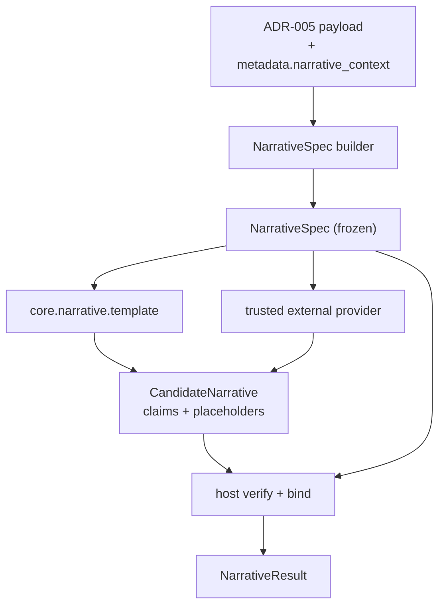

# Narrative Contract

Everything a provider author and a CE implementer need: the semantic plan, the provider
protocol, host verification, registry integration, and the public API.

Authoritative field lists live in `schemas/`. This document covers semantics the schemas
cannot express.

## Data flow



Steps 2 and 5 are the only places uncertainty semantics are decided. A provider cannot
reach them.

## Module placement (ADR-001)

```text
explanations/narrative/   contracts.py, builders.py, binding.py, verifier.py
plugins/narratives.py     NarrativeProvider protocol + metadata validation
plugins/builtins.py       registers core.narrative.template
plugins/registry.py       NarrativeProviderDescriptor + trust helpers
utils/exceptions.py       NarrativeError hierarchy
core/narrative_generator.py   existing YAML engine, reused unchanged
```

`plugins/narratives.py` parallels the existing `explanations.py`, `intervals.py`, and
`plots.py`. Nothing is added to `viz/`; `viz/narrative_plugin.py` becomes a thin legacy
adapter for `plot(style="narrative")`.

## Semantic source

1. The ADR-005 payload plus the ADR-008 domain object is canonical.
2. `metadata.narrative_context` supplies framing the frozen v1 payload lacks.
3. PlotSpec is never a source (ADR-037 keeps it visual).
4. Estimator access, calibration rows, and figure parsing are prohibited.

### metadata.narrative_context

| Key | Source in current code | Why the payload lacks it |
|---|---|---|
| `problem_type` | `NarrativePlotPlugin.detect_problem_type` | v1 `task` is only `classification`/`regression` |
| `class_labels` | `explanation.get_class_labels()` | not a v1 field |
| `threshold` | `explanation.y_threshold` | not a v1 field |
| `reject` | `explanation.reject_context` (ADR-029) | not a v1 field |

Each value already exists in CE. None is new analysis, so ADR-041 D10 holds. Additive
`metadata` sub-keys are permitted by the ADR-005 v1 freeze statement.

## NarrativeSpec

```python
@dataclass(frozen=True)
class NarrativeSpec:
    schema_version: str          # "1.0.0"
    spec_id: str                 # sha256 of canonical JSON minus this field
    source_binding: SourceBinding
    kind: NarrativeKind          # local_factual | local_alternative | local_fast
    task: TaskDescriptor
    facts: tuple[NarrativeFact, ...]
    mandatory_fact_ids: tuple[str, ...]
    prohibited_claims: tuple[str, ...]
    terminology: Mapping[str, str]
    metadata: Mapping[str, JsonValue]
```

`spec_id` is reproducible by any consumer, so it needs no counter or clock.

Multiclass is a per-class `local_factual`/`local_alternative` spec, matching how
`MultiClassExplanations.to_narrative` already iterates classes. Global kinds are out of
scope.

`TaskDescriptor` carries **both** `task_type` (frozen ADR-005 vocabulary) and
`problem_type` (the four-way split the current generator needs for positive-label,
runner-up, and margin wording), so neither contract is bent to fit the other.

### Naming

`NarrativeSpec` is an intermediate representation, named by analogy to `PlotSpec`.
ADR-038 §5 governs *configuration* surfaces, which here are `NarrativeProviderSpec` and
`NarrativeOptions`. ADR-041 D2 records this so the suffix is decided, not assumed.

### Build invariants

Violations raise `NarrativeSpecError` except where noted.

1. Every interval satisfies `lower <= estimate <= upper`. A violation is a hard
   `ValidationError`, per ADR-021 and ADR-026 §2 — never coerced or truncated.
2. Probabilities lie in `[0, 1]` within declared tolerance.
3. Interval and threshold flags equal their bound relations.
4. `direction_supported` is false whenever the effect interval crosses zero.
5. Every fact has a source reference, or a declared derivation from referenced facts.
6. Fact IDs are unique; every mandatory fact ID exists exactly once.
7. Causal and actionable permissions default to false.
8. Reject/defer state is preserved and becomes mandatory when active (ADR-029).
9. Non-finite values are rejected, or marked missing with a reason.
10. Expertise level cannot change facts, mandatory facts, permissions, prohibited
    claims, or `spec_id`.
11. Building the same payload twice yields byte-identical canonical JSON.

`direction`, `direction_supported`, `crosses_zero`, and `crosses_threshold` are derived
by CE and mirror the existing `crosses_zero` and `has_wide_prediction_interval` helpers.

### Mandatory facts

CE selects them before dispatch. Qualification is mandatory when an effect interval
crosses zero, a prediction interval crosses a relevant threshold, reject/defer is
active, or the source records a validity limitation. Providers may drop optional detail;
dropping a mandatory fact fails verification.

### Minimality and versioning

v1 is a claim-and-fact envelope, not an NLG ontology. A concept enters the stable schema
only when the built-in provider and one independent external provider both need it.

Unknown major versions fail before dispatch. Providers declare a supported range,
validated with CE's existing major/minor parsing — **not** `packaging.SpecifierSet`, as
CE has no `packaging` runtime dependency and this design adds none.

## Provider protocol

```python
class NarrativeProvider(Protocol):
    plugin_meta: Mapping[str, object]

    def generate(
        self,
        spec: NarrativeSpec,
        request: NarrativeRequest,
    ) -> CandidateNarrative: ...
```

`CandidateNarrative` carries ordered claims, provider identity, template/prompt version,
and bounded usage counters. It has **no free `text` field**: prose is assembled by CE
from the claims after binding, which is what stops a provider smuggling an unchecked
sentence past verification.

Providers must consume only a validated spec, cite facts for every factual and
qualifying claim, mark non-factual sentences `rhetorical`, honour the request's limits,
declare network use, and never set a final status.

No `narrative:verifier` capability exists in v1.

## Placeholder binding

A provider writes:

```text
"The calibrated probability is {{fact:f_pred.estimate}}, with a
 {{fact:f_pred.lower}} to {{fact:f_pred.upper}} interval."
```

CE substitutes values from the spec after verification. The provider chooses wording and
order; it never transcribes a number. Numeric fidelity therefore holds by construction,
which is what makes `verification.binding = "substituted"` meaningful. An unbound numeric
literal in a `factual` or `qualifier` claim fails verification.

## Host checks

Run after every generation and repair, in order:

1. `source_hash` and `spec_hash` match the request.
2. Every cited fact ID exists.
3. Every mandatory fact ID is cited.
4. No claim references a feature, class, or threshold absent from the spec.
5. No `factual`/`qualifier` claim contains an unbound numeric literal.
6. Causal, actionable, and fairness wording respects permissions.
7. Reject/defer state and validity limitations match the spec.
8. Provider and model provenance is complete.
9. Output respects `NarrativeOptions.max_output_chars`.
10. Placeholders bind successfully.

Passing is **not** proof that every linguistic nuance is faithful, and
`verification.scope_note` says so.

| `status` | Meaning |
|---|---|
| `checked` | host checks passed |
| `fallback` | requested provider failed; a checked built-in result is returned |
| `abstained` | no acceptable narrative produced |
| `unchecked` | verification disabled; unsuitable for governed use |

The previous revision's single `verified` status is dropped because it implied a
guarantee the checks do not provide.

## Plugin metadata

```python
plugin_meta = {
    "schema_version": 1,                          # ADR-006
    "name": "ce_narrative_llm.structured",        # STD-001 §7 dotted lowercase
    "version": "0.1.0",
    "provider": "official",
    "capabilities": ["narrative:provider"],
    "trusted": False,
    "data_modalities": ("tabular",),              # ADR-033
    "plugin_api_version": "1.0",                  # global CE contract version
    "supported_narrative_spec": "1.0",            # narrative contract version
    "narrative_kinds": ("local_factual", "local_alternative"),
    "network_access": True,
}
```

The built-in provider is `core.narrative.template`, auto-trusted as a `core.` first-party
adapter.

## Registry integration

Added to `plugins/registry.py` following the five existing families:

```text
NarrativeProviderDescriptor
register_narrative_provider / find_narrative_descriptor / find_narrative_provider
find_narrative_provider_trusted / list_narrative_descriptors
mark_narrative_trusted / mark_narrative_untrusted
_reset_narrative_plugin_catalog
```

`load_entrypoint_plugins` routes on `narrative:provider` where it currently routes on
`"modes" in meta`. The catalog joins `_assert_catalog_trust_consistency`.

This is a sixth parallel implementation in a 2,519-line module. ADR-041 Open Question 3
asks whether a generic kind abstraction should land first.

## Trust

Third-party providers are untrusted on installation and are not **dispatched** until
explicitly trusted via `CE_TRUST_PLUGIN`, the `pyproject.toml` allowlist, or
`mark_narrative_trusted`.

ADR-006 records that CE performs no sandboxing. `load_entrypoint_plugins` calls
`entry_point.load()` before the trust check, so importing a provider module can execute
its code. No document in this package may say an untrusted provider "cannot execute",
and the limitation must reach user documentation.

Resolution order: explicit `NarrativeProviderSpec.provider` > configured default >
`core.narrative.template`. Installation implies neither trust nor selection. A networked
provider cannot become the default through entry-point order.

## Public API

Unchanged calls, unchanged behaviour:

```python
explanation.to_narrative()      # template_path, expertise_level, output_format,
explanation.to_dataframe()      # conjunction_separator, align_weights
explanation.narrate()
explanations.plot(style="narrative")
```

Documented formats remain `dataframe`, `text`, `html`, `dict`, `markdown`. Byte-for-byte
prose equality is not contracted (ADR-041 D11).

### Configuration (ADR-038)

The earlier draft proposed `format="result"`, `audience`, `detail`, `locale`,
`verification`, `failure_policy`, and `provider_options`. Every one would raise
`ConfigurationError` today — `reject_unsupported_narrative_kwargs` maps `format` to an
explicit replacement then rejects any remaining unknown name
(`api/params.py:47`, `:184`) — and seven loose kwargs violate ADR-038 §3.

```python
@dataclass(frozen=True)
class NarrativeProviderSpec:          # Strategy tier: which path
    provider: str = "core.narrative.template"
    verification: Literal["strict", "lenient", "off"] = "strict"
    on_failure: Literal["fallback", "abstain", "raise"] = "fallback"
    fallback_provider: str = "core.narrative.template"


@dataclass(frozen=True)
class NarrativeOptions:               # Tuning tier: numeric limits
    timeout_seconds: float = 30.0
    max_attempts: int = 2
    max_output_chars: int = 8_000
```

`*Spec` carries no numerics (ADR-038 §2b); three grouped numerics justify a dataclass
over flat kwargs (§2c); `expertise_level` stays a flat kwarg because it already exists
and is a single value.

```python
result = explanation.to_narrative(
    output_format="result",
    expertise_level="advanced",
    narrative_provider=NarrativeProviderSpec(provider="ce_narrative_llm.structured"),
    narrative_options=NarrativeOptions(timeout_seconds=20.0),
)
```

Both new parameters are keyword-only and default to `None`. With both `None` the call is
indistinguishable from today's.

### Structured facade

```python
spec = build_narrative_spec(explanation, kind="local_factual")
result = render_narrative(spec, narrative_provider=NarrativeProviderSpec(...))
```

Enables builder tests, offline replay, and comparing providers on the identical plan
without exposing the estimator.

### Errors (ADR-002)

Added to `utils/exceptions.py` alongside the `PlotPluginError` precedent, all inheriting
`CalibratedError`:

```text
NarrativeError
├── NarrativeSpecError          # builder could not produce a valid plan
├── NarrativeProviderError      # unknown, untrusted, incompatible, timed out, malformed
└── NarrativeVerificationError  # candidate failed host checks
```

Unsupported kwargs keep raising `ConfigurationError` through the existing path.

### Output formatting

`output_format="result"` returns `NarrativeResult`; other formats are CE formatters over
it. The HTML formatter must escape provider text and emit only CE-controlled markup.

**Existing defect:** `NarrativePlotPlugin._format_as_html` interpolates values into
`<td>`/`<th>` without escaping, so a feature label containing markup is emitted raw. That
is exploitable today, before any LLM provider exists, and should be fixed regardless.

## Security and privacy

**Threats:** disclosure to remote providers; prompt injection through feature labels and
values; hallucinated or overconfident claims; HTML/script injection; provider retention or
training on submitted data; secret leakage; uncontrolled cost and latency; silent
fallback; persuasive prose causing inappropriate reliance.

**Data minimisation.** Build the spec from validated payloads only. Include only the facts
the request needs. Exclude raw rows and identifiers unless explicit policy permits
specific values.

**Injection resistance.** Facts are schema-encoded untrusted data, never concatenated as
instructions. Structured output is required where the provider supports it. Provider
markup is treated as text and escaped by CE formatters. Canonical IDs stay separate from
sanitised display labels.

**Human factors.** Keep the numerical explanation accessible alongside the prose, and never
present prose as more authoritative than the calibrated values behind it. Evaluation
prioritises appropriate reliance, confidence calibration, and error detection over
preference or generic trust.

## Logging and provenance (ADR-028, STD-005)

| Event | Domain | Mechanism |
|---|---|---|
| Provider trust, deny, checksum | `calibrated_explanations.governance.plugins` | `emit_plugin_governance_event` |
| Provider selection, fallback, timeout | `calibrated_explanations.plugins.*` | module logger, INFO |
| Fallback user signal | — | `UserWarning` |

Allowed by default: hashes, IDs, versions, timings, counts, the network flag, status,
error class. Prohibited by default: narrative text, prompts, vendor responses, feature
values, feature labels, identifiers, secrets.

`NarrativeResult` records CE version, source hash, spec hash, provider and model
identity, prompt/template version, expertise level, network flag, verification outcome
and binding, attempts, fallback status, and timing.

`source_calibrated=true` never implies the narrative is verified, and host verification
never implies a statistical guarantee.
