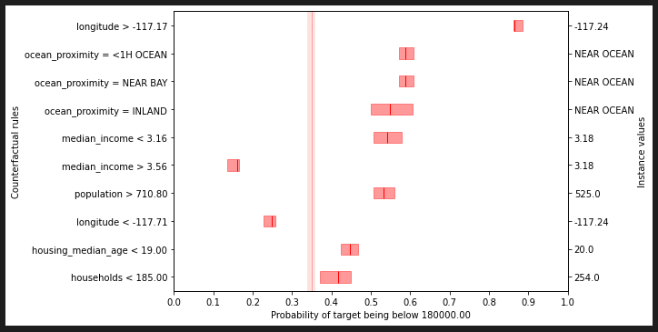

.. Calibrated-explanations documentation master file, created by
   sphinx-quickstart on Mon Aug  7 14:45:06 2023.
   You can adapt this file completely to your liking, but it should at least
   contain the root `toctree` directive.

Welcome to Calibrated-explanations's documentation!
===================================================

.. raw:: html

   

.. title:: Calibrated-explanations

``calibrated-explanations`` is a Python package that implements the calibrated-explanations method for classification and regression models.

.. raw:: html

   

Contents
--------

.. toctree::
    :maxdepth: 1
    :caption: Contents:

    getting_started
    citing
   contributing
   pr_guide
    calibrated_explanations
   error_handling
   schema_v1
   migration_0_5_to_0_6

Optional extras
----------------

Some functionality is provided via optional extras to keep the core lean:

* Visualization (matplotlib): ``pip install "calibrated_explanations[viz]"``
* LIME integration: ``pip install "calibrated_explanations[lime]"``

Plotting will raise a friendly error if matplotlib isn’t installed, with a hint to install the ``viz`` extra.

Introduction
------------

`calibrated-explanations` is a Python package for the local feature importance explanation method called Calibrated Explanations, supporting both `classification <https://doi.org/10.1016/j.eswa.2024.123154/>`_ and `regression <https://arxiv.org/abs/2308.16245/>`_.
The proposed method is based on Venn-Abers (classification & regression) and Conformal Predictive Systems (regression) and has the following characteristics:

   * Fast, reliable, stable and robust feature importance explanations for:
      * Binary classification models (`read paper <https://doi.org/10.1016/j.eswa.2024.123154/>`_)
      * Multi-class classification models (`read paper <https://easychair.org/publications/preprint/rqdD/>`_)
      * Regression models (`read paper <https://arxiv.org/abs/2308.16245/>`_)
         * Including probabilistic explanations of the probability that the target exceeds a user-defined threshold
         * With difficulty adaptable explanations (conformal normalization)
   * Calibration of the underlying model to ensure that predictions reflect reality.
   * Uncertainty quantification of the prediction from the underlying model and the feature importance weights.
   * Rules with straightforward interpretation in relation to instance values and feature weights.
   * Possibility to generate alternative rules with uncertainty quantification of the expected predictions.
   * Conjunctional rules conveying feature importance for the interaction of included features.
   * Conditional rules, allowing users the ability to create contextual explanations to handle e.g. bias and fairness constraints (`read paper <https://doi.org/10.1007/978-3-031-63787-2_17/>`_).

Example
-------

Below is an example of a probabilistic alternative explanation for an instance of the regression dataset California Housing (with the threshold 180 000). The light red area in the background is representing the calibrated probability interval (for the prediction being below the threshold) of the underlying model, as indicated by a Conformal Predictive System and calibrated through Venn-Abers. The darker red bars for each rule show the probability intervals that Venn-Abers indicate for an instance changing a feature value in accordance with the rule condition.

