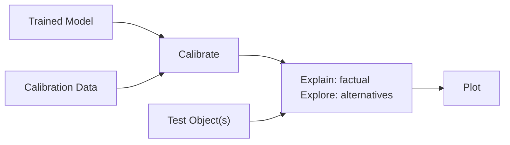
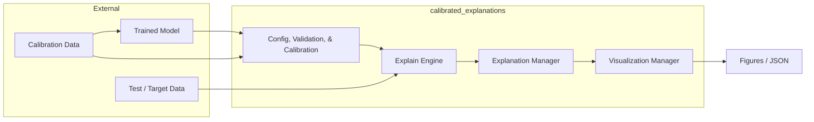
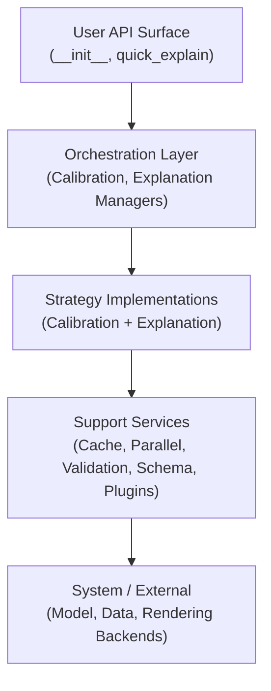

# High-Level Component Diagram: Explain Flow

Covers end-to-end path: **Training → Calibration → Explanation → Visualization** with supporting cross-cutting services.

## Overview

External model training precedes library flow. The library consumes a trained model and dataset samples to calibrate predictive uncertainty and generate explanations, emitting versioned artifacts and visualizations.

## Simplified User Flow with CalibratedExplainer (Public Mental Model)

Key steps:

1. Fit your model (outside library scope).
2. Calibrate once with calibration set.
3. Generate factual or alternative explanations.
4. Plot results.

(Internals like cache, parallelism, plugins are transparent and optional.)

## Detailed Internal Flow (Primary Runtime Path)

## Layered View

## Component Responsibilities

| Component | Responsibility | Key ADR |
|-----------|----------------|---------|
| Config & Validation | Normalize parameters, enforce types, raise structured errors | 002 |
| Calibration Orchestrator | Select + run calibration strategy, produce PredictionSet/Intervals | 001 |
| Cache Layer | Reuse deterministic intermediate artifacts; bounded memory | 003 |
| Parallel Executor | Heuristic strategy selection (thread/process/joblib/serial) | 004 |
| Explanation Manager | Coordinate explanation strategies, reuse calibrated artifacts | 001 |
| Schema & Validation | Versioned JSON envelope for explanations | 005 |
| Plugin Registry | Controlled discovery & trust gating of third-party strategies | 006 |
| Visualization (PlotSpec) | Backend-agnostic spec & rendering adapters | 007 |
| Metrics/Logging | Hit ratios, latency, resource stats, structured logs | (Cross-cutting) |

## Cross-Cutting Concerns

- **Validation & Exceptions (ADR-002):** Guard each entry boundary (config ingestion, strategy inputs, schema emit).
- **Caching (ADR-003):** Applied at idempotent, high-cost steps (calibration stats, attribution tensors).
- **Parallelism (ADR-004):** Encapsulated so strategies request parallel map without backend coupling.
- **Schema (ADR-005):** Ensures explanation portability & stability.
- **Plugins (ADR-006):** Extend strategies & (later) visual kinds under explicit trust.
- **Visualization (ADR-007):** Separate semantic explanation data from render logic.

## Evolution Notes

- Initial implementation stubs some services (cache disabled, serial execution) to preserve behavior parity.
- After baseline metrics, caching + parallel heuristics activate behind config flags.
- Additional backends (plotly, distributed executors) integrate by appending new strategy or renderer classes without changing core orchestrators.

## Usage Narrative (Happy Path)

1. User supplies trained model + data to high-level API.
2. Config normalized; deprecated args warned.
3. Calibration orchestrator computes calibrated artifacts (possibly using cache + parallel executor).
4. Explanation manager derives attributions/intervals, reusing artifacts.
5. Explanation objects serialized (schema v1) and optionally rendered via PlotSpec → backend figure.
6. Metrics recorded; user inspects figures & serialized JSON.

---

This diagram satisfies Phase 0 pre-condition and anchors subsequent refactors.
